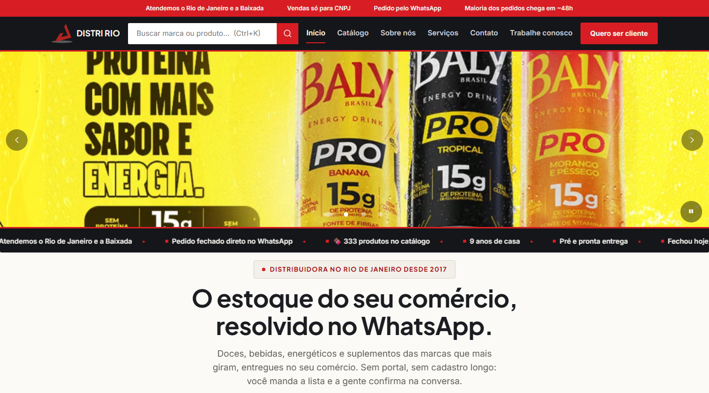

<h1 align="center">Enzo Rezende</h1>

  Desenvolvedor web no Rio de Janeiro. 
  Faço sites rápidos, acessíveis e fáceis de manter, em HTML, CSS e JavaScript puros.

  

 

## Em destaque: Distri Rio

Site institucional e catálogo da **Distri Rio**, distribuidora B2B do Rio de Janeiro e da Baixada Fluminense. Fiz o site do zero e cuido dele até hoje.

- **333 páginas de produto e 19 de marca**, todas geradas a partir de um único arquivo JSON por scripts Node, sem framework nem bundler
- **Lista de pedido que termina no WhatsApp**, com busca instantânea (Ctrl+K) no catálogo inteiro
- **CI no GitHub Actions** que barra build fora de sincronia, link quebrado e imagem órfã, e roda testes de fumaça num Chrome headless
- **Fotos em WebP e AVIF**, cache-busting por hash, dados estruturados para o Google e consentimento de cookies conforme a LGPD
- Publicado pelo GitHub Pages com domínio próprio: um `push` na `main` já coloca o site no ar

 

## Stack

  

 

## Outros projetos

| Projeto | O que é |
|---|---|
| [Catálogo de Séries](https://enzogaliazzo.github.io/ProjetoAlura/) | Catálogo com busca e filtro por gênero, carregado de um JSON. Fiz durante os estudos na Alura. |

 

  Rio de Janeiro, Brasil

